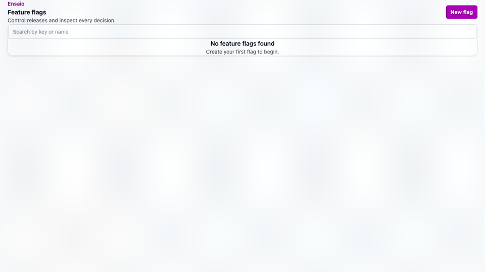

# Ensaio

Ensaio is a small, working feature-flag platform built to understand the architecture and engineering trade-offs behind PostHog's Feature Flags product. It combines a pure deterministic evaluation kernel, a Django management and evaluation API, a React/Kea console, local-evaluation definition polling, a deliberately small health-gated rollout controller, and an external agent control plane generated from the same HTTP contract. _Ensaio_ is Portuguese for “trial” or “rehearsal.”

This is an original learning project. It is not affiliated with, endorsed by, or copied from PostHog or any employer. The PostHog observations in this repository come only from public source and are labeled as verified or inferred.

Read by goal:

- Understand the system and its production limits: [Architecture and production gap register](docs/architecture-and-production-gaps.md);
- Inspect the public-source PostHog comparison: [What I learned from PostHog](docs/notes/what-i-learned-from-posthog.md);
- Make a first contribution: [Contributing guide](CONTRIBUTING.md);
- Inspect the agent contract: [`services/mcp/schema/tool-catalog.json`](services/mcp/schema/tool-catalog.json) and [`services/mcp/evals/README.md`](services/mcp/evals/README.md); or
- Browse the public documentation: [Documentation map](docs/README.md).

## Demo

The reproducible browser journey creates a targeted multivariate flag, inspects its evaluation trace, activates a phased rollout, and reverts it:



Re-record it from mocked deterministic API responses with `./bin/record-demo`. This requires Chromium and `ffmpeg`; it does not require a running backend.

## What is implemented

- A pure `ensaio_kernel` package with PostHog-compatible SHA-1 bucketing, ordered release conditions, property operators, multivariate variants, payloads, reason codes, and optional traces.
- Team-scoped Django/DRF CRUD with strict `filters` validation, soft deletion, per-write versions, session authentication, and a trace endpoint.
- A React 18 + TypeScript console whose feature state and side effects live in Kea logics. API models are generated from the DRF OpenAPI schema.
- A deliberately small PostHog-shaped `POST /flags/?v=2` endpoint that returns detailed flag results for one project token.
- A secret-authenticated `GET /flags/definitions` endpoint for local evaluation, including ETag/304 polling and post-commit cache invalidation.
- A health-gated staged rollout controller with a pure decision function, optimistic plan versions, guardrail samples, consistent flag-before-plan row locking, hold/pause behavior, and percentage-only reverts.
- Project-scoped `ens_pat_` automation credentials whose secrets are returned once, password-hashed at rest, action-scoped, and accepted alongside existing session/CSRF authentication.
- An independent TypeScript stdio MCP server using the official SDK. Twelve product-curated atomic tools call the real HTTP API; OpenAPI and strict product YAML generate their handlers and catalog.
- A discoverable health-gated-rollout resource/prompt, native skill sync, and a versioned 12-task benchmark with REST fixture reset, read-only probes, deterministic trace/final-state scoring, and an explicit OpenAI model adapter.
- Full Python and TypeScript static checks, backend and frontend unit tests, API and MCP generation-drift checks, package boundaries, and a mocked Playwright product smoke test.

Everything above is implemented and covered by the repository's verification commands; the browser smoke and production build run separately from `./bin/test` and also run in CI. The limitations section is equally important: this is not a production PostHog replacement.

## PostHog and Ensaio: same ideas, different goals

The comparison baseline is PostHog's public repository at commit [`40eeb716`](https://github.com/PostHog/posthog/tree/40eeb716559d19325eb82b381663dd07ba9c8020). “PostHog” below means the public code examined at that revision, not a claim about private systems or every current product capability.

| Concern | Public PostHog implementation | Ensaio implementation |
| --- | --- | --- |
| Product scope | A production product with broad flag targeting, identity, groups, cohorts, experiments, analytics, billing, and operational infrastructure | One teachable vertical slice: flags, trace, definitions, a small rollout controller, and an agent control plane |
| Management and evaluation | Django owns management; a separate Rust service serves runtime evaluation and definitions | Django owns management and the live endpoint; a zero-I/O Python package holds evaluation policy and can also run beside a definitions consumer |
| Definition propagation | Cache-building machinery, versioned invalidations, Redis/S3-backed HyperCache, background processing, and repair paths | PostgreSQL plus process-local cache, post-commit invalidation, and consumer polling with ETags |
| Identity | Person/group identity selection, device bucketing, and experience-continuity behavior | The caller supplies one `distinct_id` and properties; there is no identity or person store |
| Flag matching | A much broader production matcher and response contract | A deliberately narrow property-operator subset with compatible v1 hashing/bucketing once an identifier is selected |
| Frontend | A large product application and design system | React/Kea list, edit, and trace scenes in a product-owned vertical slice |
| Tenancy and auth | Production organization/project membership and authorization surfaces | Team-scoped query practice; staff users can operate every team; automation credentials are project- and scope-bound |
| Rollout operations | Scheduled flag changes and experiment-analysis capabilities exist in the examined public code | One sample-driven absolute-threshold controller owns one condition percentage and holds when evidence is missing |
| Agent interface | Product-owned MCP curation, generated tools, workflow skills, and production service infrastructure | The same product-owned/generation shape in an independent local stdio service with twelve bounded tools |
| Operations | Horizontally operated services, cache tiers, workers, observability, and abuse controls | Local processes, one PostgreSQL container, no queue/worker fleet, no rate limiting, and no production deployment claim |

The point is not to reproduce PostHog at miniature scale. Ensaio keeps the parts that expose useful engineering decisions and removes machinery whose main lesson would be operations at traffic this project does not have.

### Where Ensaio deliberately explores further

These are Ensaio-specific experiments, not claims that Ensaio is broader or better than PostHog:

- **A mechanically pure evaluation boundary.** The Python kernel is a separate zero-runtime-dependency package, and `tach check-external` prevents framework or I/O dependencies. PostHog achieves a stronger deployment-scale separation with its Rust service; Ensaio makes the policy boundary unusually visible for teaching and local reuse.
- **A health-gated rollout primitive.** In the public areas examined, PostHog had scheduled changes and experiment analysis, but this exact controller was not found: advance one condition from caller-pushed absolute-threshold samples, treat no evidence as unsafe, and revert only that condition. This is an original, deliberately small design experiment, not a parity claim.
- **Agent-safe concurrency as a first-class lesson.** Every agent-visible flag or rollout mutation carries an observed version. Rollout-plan concurrency combines immutable plan ID with mutable version to reject delete/recreate ABA races. Dedicated actions avoid exposing generic request, SQL, delete, or project-switch capabilities.
- **End-to-end generated and validated agent contracts.** Product YAML curates a strict subset of OpenAPI; generation produces handlers and JSON Schemas; the MCP runtime validates model input and projected output. Controlled absence codes are checked against OpenAPI rather than accepted as arbitrary strings.
- **A reproducible agent-evaluation harness beside the product.** Deterministic probes and protocol tests run without model credentials; real model runs are explicit, redacted, schema/retry/latency scored, and fail closed rather than manufacturing a baseline.
- **A complete learning trail.** ADRs record non-obvious choices, milestone guides reconstruct the work chronologically, and the [Production gap register](docs/architecture-and-production-gaps.md) names exactly where the implementation stops being a production design.

The path-cited evidence and the limits of each comparison are in [`docs/notes/what-i-learned-from-posthog.md`](docs/notes/what-i-learned-from-posthog.md) and ADRs 1–6.

## 60-second local quickstart

Prerequisites:

- Docker with Compose;
- [uv](https://docs.astral.sh/uv/);
- Node.js 24 with Corepack; and
- ports 5432, 8000, and 5173 available.

Install dependencies and create idempotent local demo data:

```bash
./bin/setup
./bin/bootstrap-demo
```

Start PostgreSQL, Django, and Vite:

```bash
./bin/start
```

`bin/start` stays in the foreground and stops Django/Vite when you press Ctrl+C. PostgreSQL is the only container; application processes run on the host for fast reloads.

1. Sign in at <http://127.0.0.1:8000/admin/login/> with `admin` / `ensaio`.
2. Open <http://127.0.0.1:5173/feature_flags>.
3. Create a flag, open **Trace**, and try `u_7` with `{"country":"BR"}`.

The bootstrap credentials are intentionally local and insecure. Do not use them outside this development setup. A first dependency download can take longer than a minute; repeat boots are the intended 60-second path.

Useful endpoints:

- liveness: <http://127.0.0.1:8000/healthz>;
- management API: <http://127.0.0.1:8000/api/projects/1/feature_flags/>;
- evaluation API: `POST http://127.0.0.1:8000/flags/?v=2`;
- definitions API: `GET http://127.0.0.1:8000/flags/definitions`;
- OpenAPI schema: <http://127.0.0.1:8000/api/schema/>.

The [Evaluation contract](#evaluation-contract), [architecture register](docs/architecture-and-production-gaps.md), OpenAPI schema, and ADRs document the behavior behind these endpoints.

## 60-second local MCP setup

With the quickstart running, issue a project-scoped token for an active local user (the demo bootstrap uses team and user ID 1):

```bash
uv run python manage.py issue_agent_token \
  --team-id 1 \
  --user-id 1 \
  --name local-cursor \
  --scope feature_flag:read \
  --scope feature_flag:write

cd services/mcp
corepack pnpm run build
cd ../..
```

Store the printed `ens_pat_...` value immediately; Ensaio stores only its hash. Configure a stdio-capable client with:

```json
{
  "mcpServers": {
    "ensaio": {
      "command": "node",
      "args": ["/absolute/path/to/ensaio/services/mcp/dist/src/index.js"],
      "env": {
        "ENSAIO_BASE_URL": "http://127.0.0.1:8000",
        "ENSAIO_PROJECT_ID": "1",
        "ENSAIO_API_TOKEN": "ens_pat_REPLACE_WITH_ISSUED_TOKEN"
      }
    }
  }
}
```

The generated capability contract is [`services/mcp/schema/tool-catalog.json`](services/mcp/schema/tool-catalog.json); the product curation is [`products/feature_flags/mcp/tools.yaml`](products/feature_flags/mcp/tools.yaml).
For staged rollouts, clients can discover `ensaio://skills/managing-health-gated-rollouts` as both an MCP resource and prompt. Native-skill clients can use:

```bash
./bin/sync-agent-skill \
  --name managing-health-gated-rollouts \
  --target /path/to/client/skills
```

## Architecture

```text
React/Kea console
      │ session-authenticated generated client
      ▼
Django/DRF management API ───────────────────────▶ PostgreSQL 15
      │                                                 │
      │ copies ORM state into an immutable value        │ definitions
      ▼                                                 ▼
ensaio_kernel.evaluate() ◀── POST /flags       GET /flags/definitions
      ▲                   live server path       secret + ETag polling
      │
local consumer evaluates downloaded definitions without another request

tick_rollouts ─▶ pure decide(plan, samples, now) ─▶ transactional ORM effects

external agent ─▶ official SDK / stdio MCP ─▶ Bearer ens_pat_ ─▶ same HTTP API
```

The main boundary is intentional:

- `products/feature_flags/backend/` owns I/O, tenancy, authentication, transactions, and persistence;
- `packages/ensaio_kernel/` owns deterministic evaluation and imports neither Django nor product code;
- `products/feature_flags/frontend/` owns the feature's scenes and Kea state; `frontend/` is only the Vite shell and shared UI;
- serializers generate OpenAPI, OpenAPI generates TypeScript models, and CI rejects generated drift.
- `services/mcp/` is a separate HTTP client package: it imports no Django, backend, kernel, or database code.

[`tach.toml`](tach.toml), Ruff's forbidden-import rules, and `tach check-external` make the Python boundary executable rather than aspirational.

For request-by-request flows, code ownership, retained production habits, and a decision-by-decision account of what would need to change at scale, read the [Architecture and production gap register](docs/architecture-and-production-gaps.md).

## Evaluation contract

One condition is an AND of its property filters followed by deterministic rollout bucketing. Conditions are tried as an ordered OR and the first complete match wins. Multivariate selection uses a second salted hash, so rollout inclusion and variant assignment are independent.

The compatibility claim is deliberately narrow: after an application has selected a `distinct_id`, Ensaio uses PostHog's v1 SHA-1 hash and bucket boundaries. Ensaio does not claim full matcher, identity, cohort, group, payload, or `/flags` parity. [ADR-1](docs/adr/0001-posthog-compatible-hashing.md) and [ADR-5](docs/adr/0005-identity-and-caller-supplied-properties.md) spell out the exact boundary.

The mandatory public-source cross-check is complete: Ensaio reproduces the published Rust hash vectors. The optional live PostHog Cloud cross-check was not performed, so no cloud-observed results or credentials are part of this repository.

## Evaluation microbenchmark

Run:

```bash
uv run python scripts/bench_eval.py
```

Baseline on Python 3.14.7, macOS 26.6.2, arm64; seven rounds of 100,000 iterations after 10,000 warmups:

| Operation | Median µs/op | Median ops/s | Min–max µs/op |
| --- | ---: | ---: | ---: |
| `hash_position` | 0.517 | 1,933,703 | 0.499–0.531 |
| `evaluate_boolean_100_percent` | 2.075 | 481,855 | 2.057–2.141 |
| `evaluate_targeted_multivariate` | 6.444 | 155,178 | 6.393–6.532 |

This is a local in-process microbenchmark, not a load test or production capacity claim. It excludes Django, SQL, HTTP, JSON, cache behavior, concurrency, and tail latency. It is useful as a reproducible regression baseline for the pure kernel only.

## Development and verification

```bash
./bin/test
```

That single command runs Ruff lint and format checks, mypy, both tach boundary checks, OpenAPI schema drift detection, pytest, frontend checks, deterministic MCP generation/skill/benchmark validation, MCP TypeScript checks, and protocol tests. Paid network model evals are deliberately excluded.

Additional checks:

```bash
cd frontend
corepack pnpm exec playwright install chromium
corepack pnpm run test:smoke
corepack pnpm run build
cd ..

uv run python manage.py tick_rollouts

./bin/generate-mcp
./bin/check-mcp
```

CI additionally runs `corepack pnpm run generate` and requires a clean Git diff, then runs the production build and Playwright smoke. Kea typegen's volatile header timestamp is normalized by `frontend/scripts/normalize-kea-typegen.mjs`, so generated drift represents a real contract change.

After changing a serializer, view, route, or Kea logic:

```bash
./bin/generate-schema
cd frontend
corepack pnpm run generate
cd ..
./bin/generate-mcp
```

Do not hand-edit `frontend/openapi.json`, generated API models, or `*LogicType.ts` files. Do not hand-edit `services/mcp/src/tools/generated.ts` or `services/mcp/schema/tool-catalog.json`.

### Agent benchmark status

Deterministic benchmark validation and MCP protocol tests run locally and in CI. The 2026-10-03 synthetic loopback integration completed all four read-only probes (p50 100 ms, p95 118 ms). That one developer-machine run includes process and HTTP overhead; it is neither a model eval nor a capacity claim. The chosen external client was the official MCP SDK stdio client; it loaded the rollout skill as a resource and completed an MCP create → trace → rollout-plan workflow with REST final-state verification. The real adapter requires `OPENAI_API_KEY` plus an explicit `ENSAIO_EVAL_MODEL`; the runner fails before writing output when either is missing. No M7 model baseline is checked in because provider credentials were not available for the implementation run, and no result was fabricated. See [`services/mcp/evals/README.md`](services/mcp/evals/README.md).

## What I noticed using and reading PostHog

- Hash compatibility depends on tiny choices—prefix, salt, 60-bit slice, inclusive versus strict boundaries, list order—not merely on using SHA-1.
- Identity selection happens before hashing. Group keys, device bucketing, and anonymous-to-identified continuity are product policy, not hash details.
- The v2 response contract includes serde casing and omission behavior; it cannot be reconstructed safely from Python naming conventions.
- A successful database write is not the end of configuration propagation. Post-commit invalidation, versioned messages, builders, and repair loops make runtime freshness a system.
- Time-scheduled changes and experiment analysis are adjacent to, but not the same primitive as, Ensaio's sample-driven absolute-threshold controller.

The complete source study is [What I learned from PostHog](docs/notes/what-i-learned-from-posthog.md).

## Security, scope, and non-goals

The concise list below is backed by the code-level [Architecture and production gap register](docs/architecture-and-production-gaps.md), which records why each simplification works for this project, how it fails at scale, and the likely production direction.

- The console treats every Django staff user as an operator for every team. There is no organization membership model or production RBAC.
- Automation tokens are project-scoped and have read/write scopes, but M7 does not add organization RBAC, token-management UI, OAuth, rate limiting, or a hosted MCP transport.
- `POST /flags` looks up a raw public project token. Definitions use a secret token whose password hash is stored, but lookup scans teams in this small project.
- There is no person store, identity merge, experience continuity, group evaluation, cohort engine, event ingestion, analytics, experimentation statistics, billing, rate limiting, audit log, or SDK.
- Live evaluation currently reads PostgreSQL through Django. It is not a low-latency horizontally scaled evaluation fleet.
- Definitions use process-local memory caching. There is no Redis, S3, queue, push invalidation, cross-process coherence, or cache-repair worker.
- The rollout controller accepts caller-supplied samples and an absolute threshold. It does not establish causality, compare treatment/control populations, or schedule itself.
- MCP exposes no delete, scheduler, SQL, arbitrary-request, or project-switch tool. Stdio is local-only. Agent traces and benchmarks are development evidence, not production reliability claims.
- Development defaults, bootstrap credentials, CORS policy, and `ALLOWED_HOSTS` are local-only. A real deployment needs a security and operations design.

## Contributing

Contributions are welcome, including from people new to this stack. Start with [`CONTRIBUTING.md`](CONTRIBUTING.md), which provides:

- A first-contribution path and issue workflow;
- Exact setup and verification commands;
- A map from change type to files, generation steps, and tests;
- Architecture, security, generated-file, and AI-assistance rules;
- Pull-request and review expectations; and
- Guidance for proposing durable architectural decisions.

Repository issue forms distinguish bugs, documentation gaps, and design proposals. The pull-request template asks for the problem, verification, and architectural/scale impact so important decisions are visible during review.

## Architecture decisions

1. [ADR-1 — PostHog-compatible hashing and bucketing](docs/adr/0001-posthog-compatible-hashing.md)
2. [ADR-2 — Pure Python evaluation boundary](docs/adr/0002-python-evaluation-boundary.md)
3. [ADR-3 — Definitions polling and ETags](docs/adr/0003-definitions-etag-and-polling.md)
4. [ADR-4 — Health-gated rollout controller](docs/adr/0004-health-gated-rollout-controller.md)
5. [ADR-5 — Identity and caller-supplied properties](docs/adr/0005-identity-and-caller-supplied-properties.md)
6. [ADR-6 — Agent control plane over the management API](docs/adr/0006-agent-control-plane.md)

Contributor and agent constraints are in [`AGENTS.md`](AGENTS.md).

## Project documentation

- [Documentation map](docs/README.md)
- [Architecture and production gap register](docs/architecture-and-production-gaps.md)
- [What I learned from PostHog](docs/notes/what-i-learned-from-posthog.md)
- [Agent eval guide](services/mcp/evals/README.md)
- [Contributing guide](CONTRIBUTING.md)

The README, architecture register, ADRs, generated API/MCP contracts, and tests define the public project scope. Contributor and agent constraints are in [`CONTRIBUTING.md`](CONTRIBUTING.md) and [`AGENTS.md`](AGENTS.md).